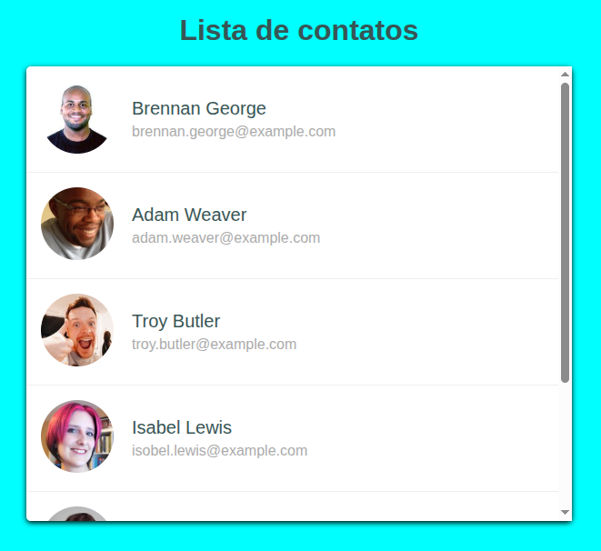

# 📒 Segundo Desafio – Lista de Contatos (HTML & CSS)  

Este repositório contém o **segundo desafio** que desenvolvi no curso **SerFrontend**.  
O objetivo foi criar uma **lista de contatos** utilizando apenas **HTML e CSS**, aplicando conceitos de listas, estilização e organização de informações em um layout limpo e funcional.  

---

## 📸 Demonstração do Projeto  

  

---

## 📖 Descrição  

Neste projeto aprendi a:  
- Criar e estruturar listas no HTML.  
- Estilizar listas e elementos de contato com CSS.  
- Trabalhar com espaçamentos, ícones e tipografia.  
- Desenvolver uma interface simples, clara e organizada.  

Esse desafio reforçou conceitos de **estruturação e estilização básica**, fundamentais para projetos futuros mais complexos.  

---

## 👤 Autor  
**Yuri Duarte**  

---

## 📚 Referências  
Este projeto faz parte do curso:  
👉 [SerFrontend – Curso HTML, CSS e JS](https://serliv.com/html-css-js)  

---
